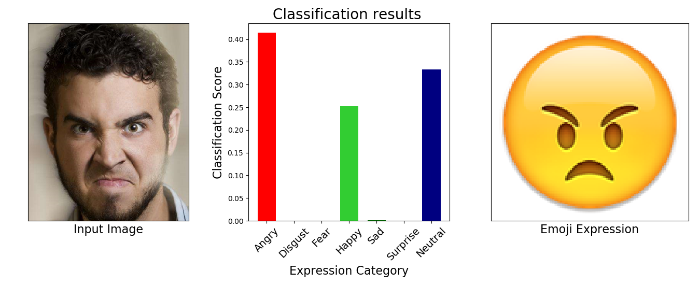

# Facial_expression_recognition_DeepCNN_Light

Using VGG or Resnet to learn facial expression recognition with FER2013 dataset. This repository includes two parts, training with CNNs(VGG19 or Resnet18) and pruning the trained model to light the models. People who are interested in the theory of CNN and why we use deep CNN for expression recognition may want to look at this: https://zhuanlan.zhihu.com/p/39779767 or other papers I listed in the reference part.

## Training and Original Results

The dataset is FER2013, you could find it here: https://www.kaggle.com/c/challenges-in-representation-learning-facial-expression-recognition-challenge/data or you could download it from here: https://blog.csdn.net/qq_45534921/article/details/105792857. 

Image Properties: 48 x 48 pixels (2304 bytes) labels: 0=Angry, 1=Disgust, 2=Fear, 3=Happy, 4=Sad, 5=Surprise, 6=Neutral The training set consists of 28,709 examples. The public test set consists of 3,589 examples. The private test set consists of another 3,589 examples.

### Demos



### Dependencies

* Python 2.7
* Pytorch >=0.2.0
* h5py (Preprocessing)
* sklearn (plot confusion matrix)
However it seems that python >= 3 still works, but you need to change some code.

### Example Usage

0. Preprocess FER2013 dataset
Put FER2013 to data folder and then:
```
python preprocess_fer2013.py
```
If you want to use FER2013Plus label and see the training pictures: https://github.com/microsoft/FERPlus

1. Train and eval model
Make sure the path is right (I put my path on server in and I am too lazy to modify the code right now.).
```
python mainpro_FER.py --model VGG19 --bs 128 --lr 0.01
```
Or 
```
python mainpro_FER.py --model Resnet18 --bs 128 --lr 0.01
```
if you prefer Resnet.

2. Plot confusion matrix
Make sure batch size and net is the same.
```
python plot_fer2013_confusion_matrix.py --model VGG19 --split PrivateTest
```
3. Results
fer2013 Accurary             

- Model：    VGG19 ;       PublicTest_acc：  72.596% ;     PrivateTest_acc：73.212%     <Br/>
- Model：   Resnet18 ;     PublicTest_acc：  72.290% ;    PrivateTest_acc：72.975%  


By the way this code could process CK+ dataset too. If you want to do that:

0. Train and Eval model for a fold
```
- python mainpro_CK+.py --model VGG19 --bs 128 --lr 0.01 --fold 1
```
1. Train and Eval model for all 10 fold
```
- python k_fold_train.py
```
2. plot confusion matrix for all fold
```
- python plot_CK+_confusion_matrix.py --model VGG19
```
3. Results
CK+ Accurary
- Model：    VGG19 ;       Test_acc：   94.646%   <Br/>
- Model：   Resnet18 ;     Test_acc：   94.040%   

CK+ could be found here: https://pan.baidu.com/s/1ytIBzIAKpKbfI6mstYZNvQ 
extract code: uwd5

## Prune Model (Network Slimming)

### Introduction

Network Slimming is a neural network training scheme that can simultaneously reduce the model size, run-time memory, computing operations, while introducing no accuracy loss to and minimum overhead to the training process. The resulting models require no special libraries/hardware for efficient inference.

### Example Usage
  
This repo holds the example code for VGGNet.

0. Prepare the directories to save the results
1. Identify a certain percentage of relatively unimportant channels and set their scaling factors to 0

```
python prune_vgg.py --percent 0.5 --model [model path] --save [save path] 
```
2. Fine-tune the compact network
Make sure the save path is correct.
```
python fer_vgg_prune.py
```

### Prune Results


fer2013 Accurary             

- Model：    VGG19 ;       PublicTest_acc：  72.124% ;     PrivateTest_acc：72.500%     

The size is 5 times smaller, while the accuracy only drops 0.5%.

## Reference
* [Learning Efficient Convolutional Networks through Network Slimming](http://openaccess.thecvf.com/content_ICCV_2017/papers/Liu_Learning_Efficient_Convolutional_ICCV_2017_paper.pdf) (ICCV 2017).

* [Zhuang Liu](https://liuzhuang13.github.io/), [Jianguo Li](https://sites.google.com/site/leeplus/), [Zhiqiang Shen](http://zhiqiangshen.com), [Gao Huang](http://www.cs.cornell.edu/~gaohuang/), [Shoumeng Yan](https://scholar.google.com/citations?user=f0BtDUQAAAAJ&hl=en), [Changshui Zhang](http://bigeye.au.tsinghua.edu.cn/english/Introduction.html).

* Liu, Zhuang and Li, Jianguo and Shen, Zhiqiang and Huang, Gao and Yan, Shoumeng and Zhang, Changshui, Learning Efficient Convolutional Networks through Network Slimming，ICCV 2017


